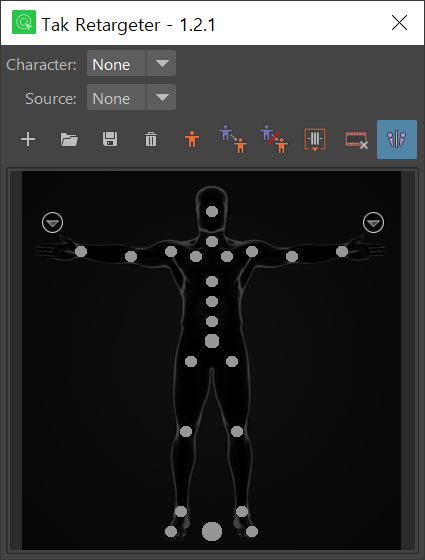

# Tak Retargeter

\
`Tak Retargeter ` is made for retargeting animation from source to target. It is simillar to HIK(HumanIK) in Maya. Source and target can be skeleton or control rig.

> **Tested Environments**
> - OS: Windows 10
> - Maya: 2022, 2023, 2024

## Install
Just drag and drop `install.py` file into the Maya viewport.
Tool icon will be added in the current shelf.
